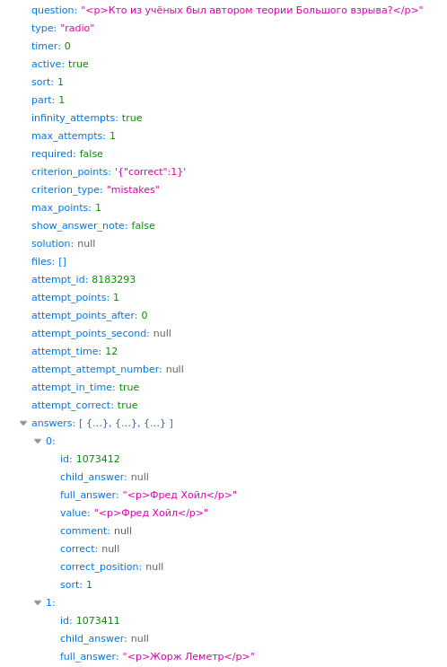

## About the Project

Source code:
[github.com/averyanalex/matetech-answers-bot](https://github.com/averyanalex/matetech-answers-bot).

Programming languages: Rust, SQL.

Key libraries:

* [tokio](https://tokio.rs/) (asynchronous runtime)
* [reqwest](https://github.com/seanmonstar/reqwest) (HTTP client)
* [sqlx](https://github.com/launchbadge/sqlx) (database driver)
* [teloxide](https://github.com/teloxide/teloxide) (framework for building
Telegram bots)

## Creation Story

In 9th grade I enrolled in an "olympiad" school—a good one with almost no
"extra" subjects, so you could peacefully prepare for competitions. Many
non-core subjects, like biology, were given as so-called distance courses that
worked roughly like this: open the e-learning site, watch a 10–15-minute
lecture, take a quiz while ~~searching the answers online~~, and get your well-
earned 80–100 % score.

### The Idea and the First Version

The process was honestly pretty boring. And what do you do when it gets boring
with a browser tab open? Right—you open the developer tools. Poke at the
elements and show your friends how you got 200 % on a quiz in 3 seconds. Open the
Network tab and watch what the site sends where while you're doing the quiz.
Finish a quiz and open the results…

And it turns out the JSON with the results contains the correct answers, even
though the site itself doesn't show them! Interesting. Let's dig deeper. Copy
the request as `curl` and run it in the terminal. Great, we can see that JSON.
Start a new quiz, change the attempt ID in the request, and… we get a response
from the server! With the quiz results (and the right answers) **before
finishing the quiz itself**.

The find was interesting, of course. But I also wanted to help my classmates and
not have to open the console every time. I asked a friend to send me the attempt
ID of one of his quizzes, substituted it… it worked! I removed the authorization
header from the request—access error. So the genius developers of the platform
did check for the presence of authorization (as I recall, a valid one—a random
token won't work), but completely skipped the permission check. Well, good job
guys, at least you did something.

The rest was just engineering. I wrote a simple [Telegram bot in
Python](https://github.com/averyanalex/matetech-answers-bot/tree/legacy) that,
given a quiz ID, sent all the answers. But I didn't want to "out" that the
answers were essentially public on the site, or reveal the bot. I rewrote the
bot—now when it sees an attempt ID it hasn't encountered before it posts the
answers to a public Telegram channel, as if the quiz had been solved manually
and the site had no bugs.

Word-of-mouth did its job—in a year the channel had several hundred subscribers.

### The Second Version

The vulnerability—actually a gaping hole—was so obvious that many people found
it. By the next year one ~~brilliant~~ weird student of the math-IT track made a
project titled something like "Vulnerabilities of the Distance Course
Platform." I don't know what exactly was in it, but some issues were fixed
afterwards. First, fetching somebody else's quiz results became impossible.
Second, for multiple-choice questions the correct answer stopped being displayed
in the results.

It was clear the bot needed to become more sophisticated, and I didn't want to
develop that Python prototype further (it had already worked for more than a
year). A friend and I decided to write a [new version in
Rust](https://github.com/averyanalex/matetech-answers-bot) since we knew it
better. We implemented login with token saving to the database, so we could get
quiz results for different users.

The only remaining problem was with multiple-choice questions—unlike text input
ones, there were no answers. But after carefully looking at the JSON I noticed a
`score` field. It turned out to be 0 if the current saved answer is wrong and
>0 if it's correct. Perfect, we can simply iterate over all options until the
score changes.

Of course, this required teaching the bot to answer questions on its own. In
general it wasn't too hard, and as a bonus we gained the ability to automatically
complete the quiz, not just fetch the answers. Cool—now "quizzes are solved
automatically for everyone, and nobody even opens them!" (A reference to a
sketch at the 9th-grade graduation. Back then it wasn't true yet.)

That's roughly how, after a couple of evenings of Rust coding, the second
version of the bot for getting distance-course answers was written. We released
it, posted a link in the Telegram channel. Not everyone rushed to sign up—many
were afraid to send their login/password from the course site to our bot. But,
as they say, that's their problem: if they don't want to use it—they don't
have to.

### Attempts to Shut the Bot Down

Soon some enterprising school students decided to try making money off it. They
created their own similar bot (with pay-per-use) and started messaging me with
proposals to shut mine down. Actually, I think they first tried back when instead
of a bot there were Telegram channels, but less actively.

They offered super "profitable" (not) deals: make my bot paid with the same
price as theirs, or shut it down and get up to 10 % of their profit. I of course
refused and jokingly offered them a price of 300 k. For some reason they weren't
happy. I thought that was it, but no…

They created a channel where they started claiming that I, allegedly, made the
bot to steal account credentials and complete quizzes for 0 points. They created
a fake profile of me, screencapped chats supposedly with me where "I" say that
cheating is bad and therefore I completed their quizzes with zeros. I don't know
who believed them—seems almost no one. I still don't know who those people were
and frankly I don't care.

## Examples of Platform Bugs

