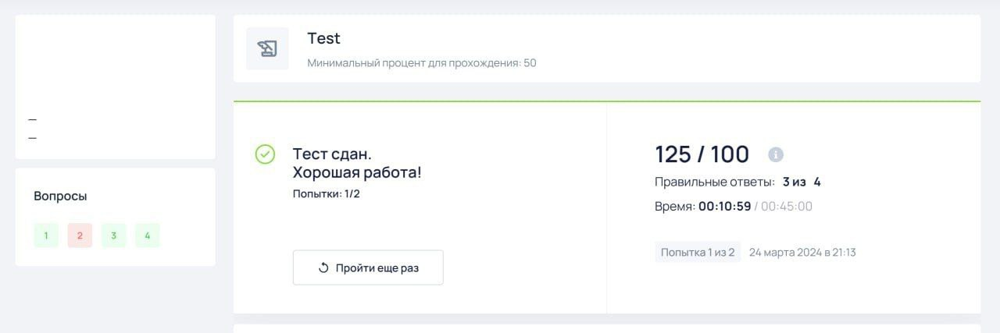

## О проекте
Языки программирования: Rust, SQL.

Ключевые библиотеки: [tokio](https://tokio.rs/) (асинхронный рантайм),
[reqwest](https://github.com/seanmonstar/reqwest) (http клиент),
[sqlx](https://github.com/launchbadge/sqlx) (работа с базой данных),
[teloxide](https://github.com/teloxide/teloxide) (фреймворк для создания
telegram-ботов).

## История создания

В 9 классе я поступил в "олимпиадную" школу. Хорошая школа, в которой почти не
было "лишних" предметов и можно было спокойно готовиться к олимпиадам. Многие
непрофильные предметы, например биология, были в виде так называемых
дистанционных курсов, которые работают примерно так: открываешь сайт системы
онлайн-обучения, смотришь 10-15 минутную лекцию, делаешь тест, ~~ища в интернете
ответы~~, и получаешь свои кровные 80-100% правильных ответов.

### Идея и первая версия

Процесс, честно говоря, достаточно скучный. А что нужно делать, когда становится
скучно с открытым браузером? Правильно, открывать режим разработчика. Потыкать
код элемента и показать друзьям, как ты сделал тест на 200% за 3 секунды.
Открыть вкладу "сеть" и посмотреть, что и куда перес    ылает сайт, пока делаешь
тест. Сделать тест и открыть результаты...

И тут оказывается, что в json-е с результатами теста есть правильные ответы,
хотя сам сайт их не показывает! Интересно. Нужно копать дальше. Копируем запрос
как curl и запускаем в терминале. Отлично, видим этот самый json. Запускаем
новый тест, меняем айди попытки теста в запросе, и... получаем ответ от сервера!
С результатами выполнения теста (и правильными ответами) **до завершения этого
самого теста**.

Находка, конечно, интересная. Но хочется и одноклассникам с тестами помочь, да и
в консоль лишний раз не лазать. Прошу знакомого скинуть мне айди попытки
какого-нибудь его теста, подставляю... работает! Убираю у запроса заголовок с
авторизацией - получаю ошибку доступа. Получается, гении-разработчики платформы
дистанционного обучения сделалали проверку наличия авторизации (как я помню,
валидной - случайный токен не подойдёт), а вот на права доступа успешно забили.
Ну, молодцы, хоть что-то они сделали.

Дальше дело техники. Написал простенького телеграм-бота на питоне, который,
получая айди теста, присылал ответы на все вопросы. Но "палить контору", что
ответы на тесты вот так висят фактически в общем доступе на сайте не хочется, а
значит и существование бота. Переделал бота - теперь он, встречая айди попытки
для теста, который он ещё не видел, отправляет ответы в публичный телеграм
канал. Как будто тесты прорешаны вручную и никаких приколов сайта нет.

Сарафанное радио сделало своё дело - за год аудитория телеграм-канала достигла
нескольких сот человек.

### Вторая версия

Уязвимость, даже нет, настоящая пробоина была настолько очевидна, что её нашло
достаточно много людей. И к следующему году один ~~гениальный~~ странный ученик
мат-инфо профиля сделал проект на тему "Уязвимости платформы дистанционных
курсов", как-то так он назывался. Что конкретно в нём было - я не знаю, но часть
проблем  после этого исправили. Во первых, получать результаты чужого теста
стало невозможно, во вторых, для тестовых вопросов (там где надо выбрать вариант
ответа) перестали показывать верный ответ в результатах.

Стало понятно, что бот нужно усложнять, и дорабатывать для этого прототип
(проработавший больше года) на питоне не хотелось. С другом решили написать
новую версию на расте, т.к. знали его лучше. Сделали вход в аккаунт с
сохранением токена в базу данных. Стало возможным получать результаты теста для
разных людей.

Осталась лишь проблема с тестовыми вопросами - на них, в отличии от вопросов с
вводом текста, ответов не было. Но, внимательно посмотрев на то, что лежит в
json-е, я заметил там "балл". Который, как оказалось, равен нулю, если текущий
сохранённый ответ неверный, и >0, если ответ верный. Отлично, значит можно
просто перебрать все варианты, пока балл не изменится.

Для этого, конечно, понадобилось научить бота отвечать на вопросы
самостоятельно. В целом, это оказалось довольно несложно, и в качестве бонуса мы
получили возможность автоматического выполнения теста, а не только получение
ответов на него. Круто, теперь "тесты выполняются у всех автоматически, и никто
их двже не открывает!" (Отсылка к номеру на выпускном 9 класса. В тот момент это
ещё не было правдой).

Примерно так, спустя пару вечеров растокодинга, была написана вторая версия бота
для получения ответов на дисткурсы. Выкатили в релиз, отправили на него ссылку в
телеграм канал. Регистрироваться торопились не все - почему-то многие боялись
отправлять логин/пароль от аккаунта на сайте дисткурсов в наш бот. Но это, как
сказать, их проблемы: не хотят использовать - пусть не используют.

### Попытки закрыть бота

Вскоре нашлись достаточно предпреимчивые школьники, которые решили попробовать
на этом заработать. Сделали сами подобного бота (с оплатой за использование) и
начали мне писать с предложениями закрыть бота. Хотя нет, кажется, первый раз
они это предлагали ещё тогда, когда вместо бота были телеграм каналы, но менее
активно.

Предлагали супер выгодные (нет) сделки: сделать моего бота платным и с такой же
ценой, как у них, или закрыть своего и получать до 10% с их прибыли. Я, конечно
же, отказался, и ради прикола предложил им цену в 300к. Цена их почему-то не
устроила. Я думал, что на этом всё, но не тут-то было...

Они сделали канал, где стали писать, что я, мол, такой-сякой, сделал бота чтобы
красть данные от аккаунтов и прохожу им тесты на 0 баллов. Сделали мой фейковый
профиль, наскринили переписки якобы со мной, где "я" пишу, что списывать плохо и
поэтому прошёл им тесты на нули. Не знаю, кто им поверил, но, кажется, почти
никто. Кто именно это был я до сих пор не знаю, да и не особо оно мне надо.

## Примеры багов платформы

