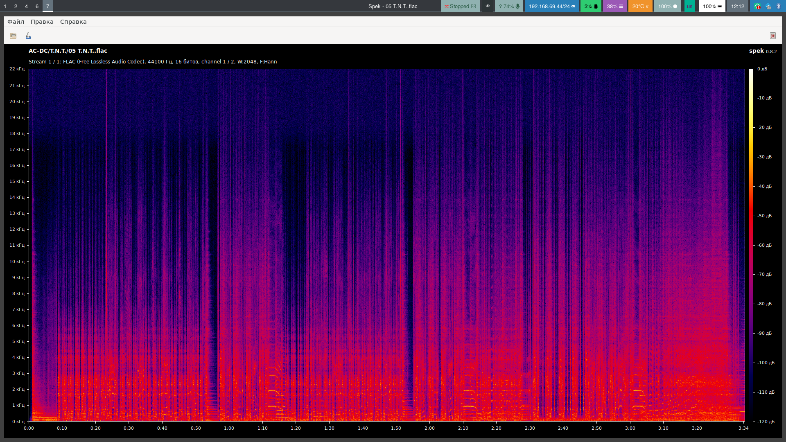
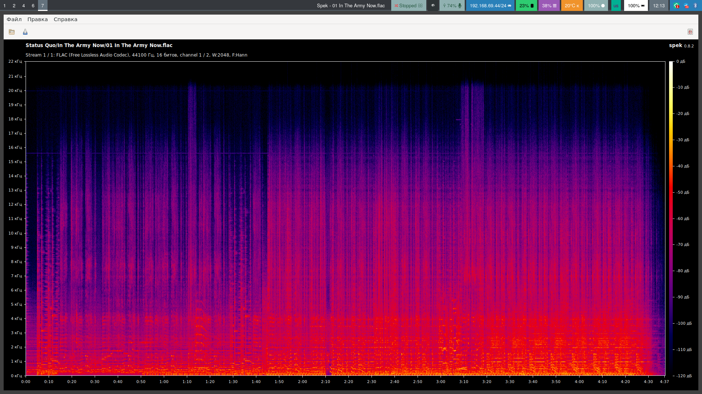

## How can we tell apart lossy codecs such as MP3?

I will not go into detail about how lossy audio codecs work—you can read about it in the
[Wikipedia article on audio data compression](https://en.wikipedia.org/wiki/Data_compression#Lossy_compression).
To spot fake FLAC files created by converting from MP3 we will take advantage of the fact
that lossy compression chops off high frequencies.
For example, a 320-kbit MP3 removes everything above 20 kHz (for lower bitrates the cutoff
is even lower). In lossless formats such as FLAC the audio remains in its original form.

## Installing the spectrum analysis program Spek

Spek is a free, open-source spectrum analyzer for audio files that runs on Windows, Linux
and macOS. It will help us identify fake FLAC.

Windows, macOS: [spek.cc](https://www.spek.cc/p/download).

On Linux, most distributions provide the package `spek`.

## Checking FLAC files for authenticity

Open the audio file you are interested in with Spek and look at its frequency spectrum.

As examples we will use Status Quo – "In The Army Now", transcoded from a 320-kbit MP3,
and AC/DC – "T.N.T." preserved in lossless quality.

### Example spectrum of a genuine FLAC

### Example spectrum of a fake FLAC transcoded from MP3

The MP3 spectrum cutoff at 20 kHz is clearly visible.
