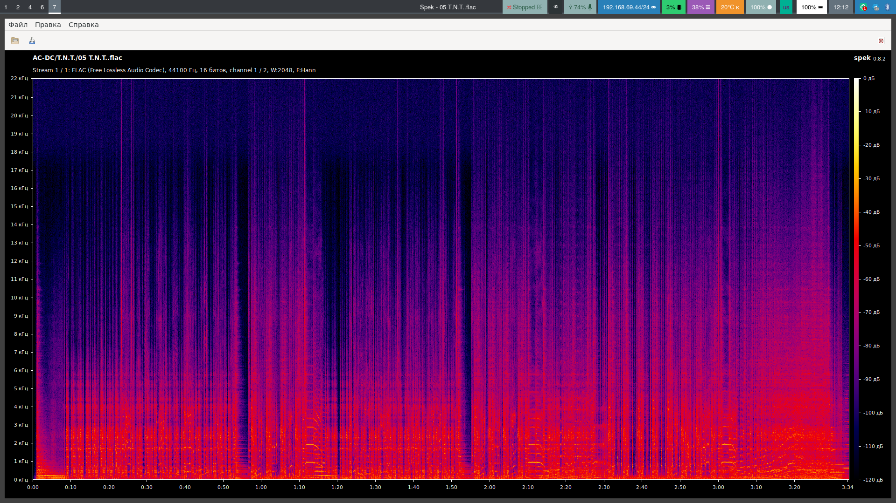

# Как можно отличить кодеки с потерями?

Я не буду подробно рассказывать про принципы работы аудиокодеков с потерями, об этом можно почитать в [википедии](https://ru.wikipedia.org/wiki/%D0%A1%D0%B6%D0%B0%D1%82%D0%B8%D0%B5_%D0%B0%D1%83%D0%B4%D0%B8%D0%BE%D0%B4%D0%B0%D0%BD%D0%BD%D1%8B%D1%85) в разделе "Сжатие с потерями". Для определения сконвертированных MP3 мы воспользуемся тем, что при сжатии с потерями отсекаются высокие частоты. Например, для 320-kbit MP3 отсекается всё, что выше 20 кГц.
В аудиоформатах без потерь же сохраняются все частоты.

# Установка Spek

Spek - бесплатная программа с открытым исходным кодом для анализа частотного спектра аудиофайлов, поддерживающая Windows, Linux и MacOS.

Windows, MacOS: [официальный сайт](http://spek.cc/). _На момент написания поста по https открывается другой сайт. Нужно открывать именно http._

Для Linux в большинстве дистрибутивов существует пакет `spek`.

# Проверяем файлы

Давайте откроем интересующий аудиофайл в Spek и посмотрим на его частотный спектр.

## Примеры спектров

В качестве примеров взят Status Quo - In The Army Now, сконвертированный из 320-kbit MP3 и AC/DC - T.N.T. без потерь.

### "Настоящий" FLAC:

### FLAC, сконвертированный из MP3:

Хорошо заметна граница спектра mp3 при 20 кГц.
