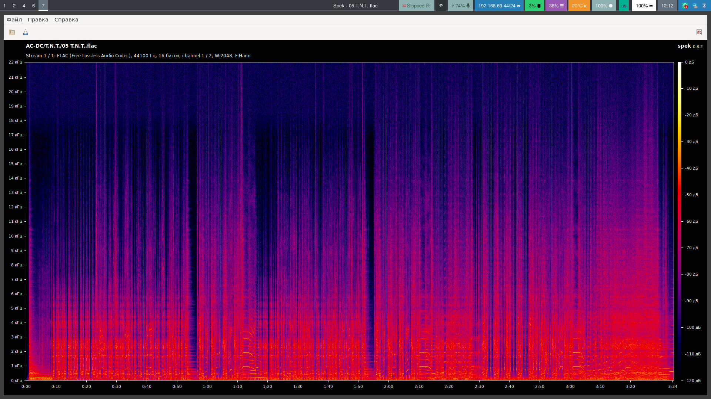
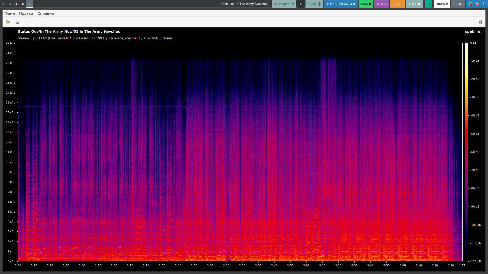

## Как можно отличить кодеки с потерями, такие как MP3?

Я не буду подробно рассказывать про принципы работы аудиокодеков с потерями, об
этом можно почитать в
[википедии](https://ru.wikipedia.org/wiki/%D0%A1%D0%B6%D0%B0%D1%82%D0%B8%D0%B5_%D0%B0%D1%83%D0%B4%D0%B8%D0%BE%D0%B4%D0%B0%D0%BD%D0%BD%D1%8B%D1%85)
в разделе "Сжатие с потерями". Для определения поддельных FLAC, созданных конвертацией из MP3 мы
воспользуемся тем, что при сжатии с потерями отсекаются высокие частоты.
Например, для 320-kbit MP3 удаляются все частоты выше 20 кГц (для более низких битрейтов порог частот тоже ниже). В форматах без
потерь, таких как FLAC, аудио остаётся в исходном виде.

## Установка программы анализа спектра Spek

Spek - бесплатная программа с открытым исходным кодом для анализа частотного
спектра аудиофайлов, поддерживающая Windows, Linux и MacOS. Она и поможет нам распознать поддельный FLAC.

Windows, MacOS: [spek.cc](https://www.spek.cc/p/download).

Для Linux в большинстве дистрибутивов существует пакет `spek`.

## Проверяем FLAC-файлы на подлинность

Давайте откроем интересующий аудиофайл в Spek и посмотрим на его частотный
спектр.

В качестве примеров взят Status Quo - In The Army Now, сконвертированный из
320-kbit MP3 и AC/DC - T.N.T. без потерь.

### Пример спектра настоящего FLAC:

### Пример спектра поддельного FLAC, сконвертированного из MP3:

Хорошо заметна граница спектра MP3 при 20 кГц.
