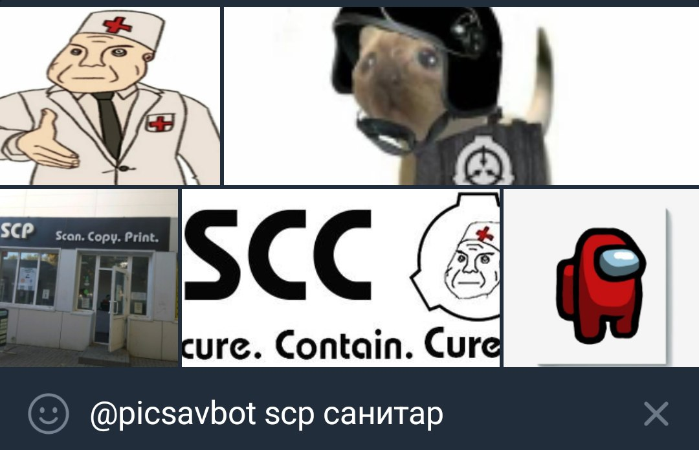
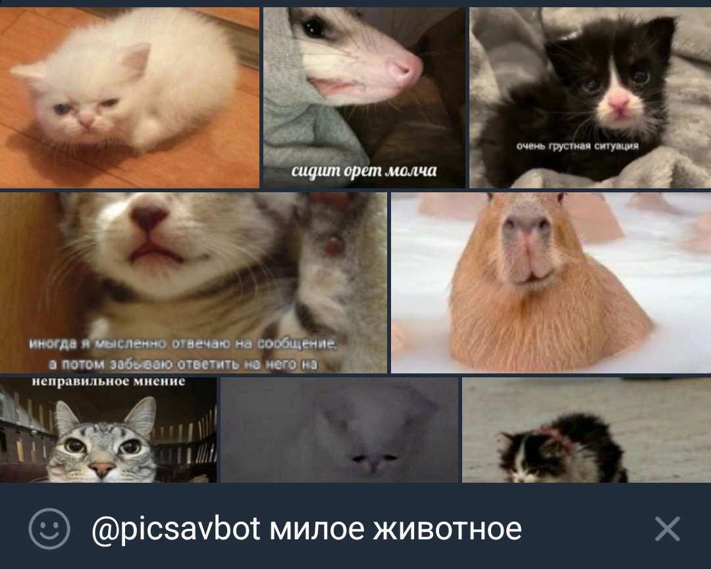

## Why PicSavBot?

Have you ever wanted to send a pic in a chat, you remember what was on it, but you can't find it in your gallery? I have. That's exactly why I created the Telegram bot [@picsavbot](https://t.me/picsavbot) to solve this problem. Just send it the images you like (as well as stickers and videos) and it will save them to your personal library. Now you can use that very pic at the perfect moment in any chat by simply typing `@picsavbot description of the pic` in the input field.

## How to write good queries

If you type "fat cat", first (provided you have such images) you will see fat cats, then just cats, and then, most likely, other animals. The CLIP neural network is not very good at reading text, but it does understand some English. On the other hand, it often recognises logos — for example, Minecraft or the [SCP Foundation](https://scpfoundation.net/) — quite well. But it knows almost nothing about memes, so write descriptions of what is in the picture as if you were explaining it to your grandma.

|What you want to find |Good search query|
|----------------------|-----------------|
|Shlyopa               |Cat with big ears|
|Gigachad              |Muscular man|
|Gachi meme            |Fight in a locker room|
|Mental hospital       |Orderly reaching out his hand|
|It's Wednesday my dudes|Frog|
|Among Us              |Red astronaut|

## How the bot works

You send an image/sticker/video to the Telegram bot [@picsavbot](https://t.me/picsavbot); it passes it to the neural network [CLIP](https://openai.com/research/clip) (the model used is LAION's [CLIP-ViT-H-14-laion2B-s32B-b79K](https://huggingface.co/laion/CLIP-ViT-H-14-laion2B-s32B-b79K)) and saves the resulting multi-dimensional vector representing the image content to a PostgreSQL database extended with the [pgvector](https://github.com/pgvector/pgvector) plugin for vector storage and search. When saving an animated sticker or video, the preview frame (usually the first frame) is taken.

To find the desired pic among the saved ones, you can type `@picsavbot picture description` in the message field of any chat. Using Yandex.Translate, the bot will translate the entered description into English, analyse it with CLIP and find the most suitable images in the database by their [cosine similarity](https://en.wikipedia.org/wiki/Cosine_similarity).

When you send one of the found images, the bot increases its usage count in its database, and if there is no search query (you type `@picsavbot` without anything else) it will first show the most frequently used pics and stickers.

## About the project

Source code: [averyanalex/picsavbot](https://github.com/averyanalex/picsavbot).

Programming languages: Rust, Python.

Key libraries: [tokio](https://tokio.rs/) (asynchronous runtime), [teloxide](https://github.com/teloxide/teloxide) (framework for building Telegram bots), [seaorm](https://www.sea-ql.org/SeaORM/) (database interaction).

