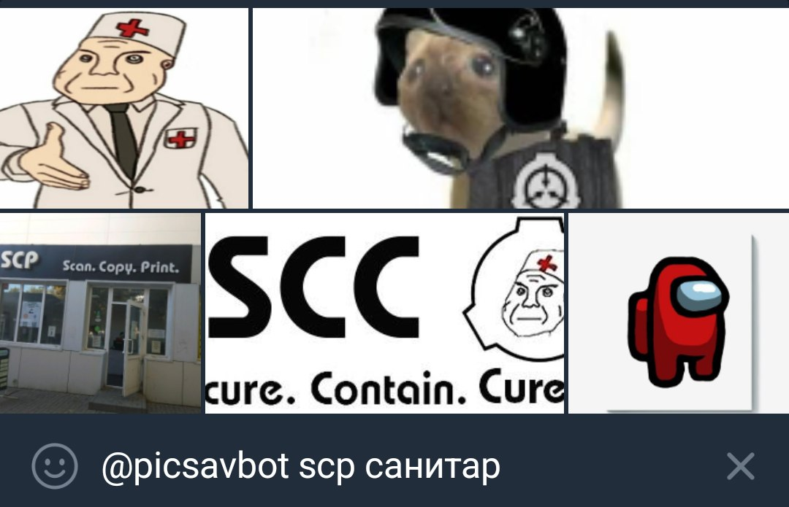
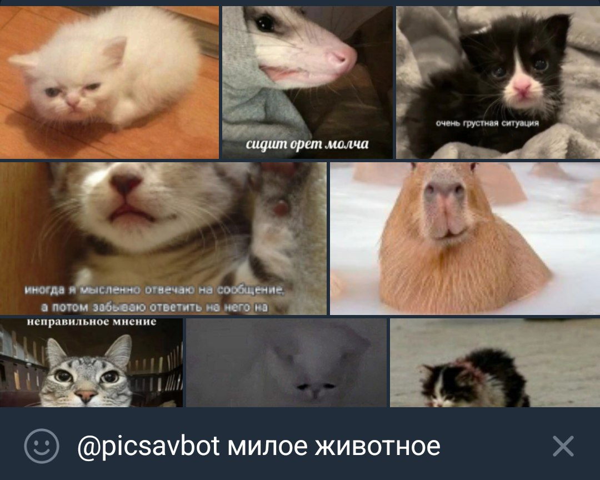
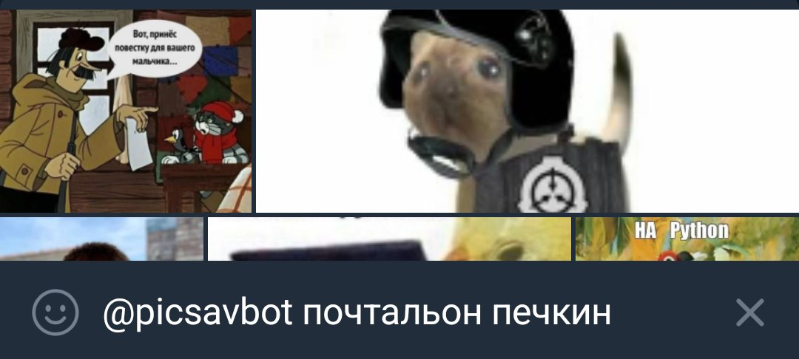

## Зачем нужен ПикчеХранитель?

У вас когда-нибудь было такое, что вы хотите отправить в чат пикчу, помните, что
на ней было, но не можете её найти в галерее? У меня -- да. Именно поэтому я
сделал телеграм-бота [@picsavbot](https://t.me/picsavbot), решающего эту
проблему. Просто отправляйте ему понравившиеся картинки (а также стикеры и
видео) и он сохранит их в вашу персональную библиотеку. Теперь вы сможете
использовать ту самую пикчу в тот самый момент в любом чате, просто написав в
поле ввода текста `@picsavbot описание пикчи`.

## Как правильно составлять запросы

Если вы введёте "жирный кот", сначала (при наличии у вас таких изображений,
конечно) вы увидите жирных котов, затем просто котов, и далее, скорее всего,
других животных. Нейросеть CLIP не очень хороша в чтении текста, но всё же
немного может понимать английский. Зато зачастую она хорошо узнаёт логотипы --
например, minecraft или [фонда SCP](https://scpfoundation.net/). Но о мемах у
неё знаний почти нет -- составляйте описания того, что находится на искомой
картинке как для своей бабушки.

|Что вы хотите найти    |Хороший поисковой запрос|
|-----------------------|------------------------|
|Шлёпа                  |Кот с большими ушами    |
|Гигачад                |Накачанный мужчина      |
|Гачи мем               |Драка в раздевалке      |
|Дурка                  |Санитар протянул руку   |
|Это среда мои чуваки   |Жаба                    |
|Амогус                 |Красный космонавт       |

## Принцип работы бота

Вы отправляете изображение/стикер/видео telegram-боту
[@picsavbot](https://t.me/picsavbot), он отдаёт его на анализ нейросети
[CLIP](https://openai.com/research/clip) (используется модель от LAION
[CLIP-ViT-H-14-laion2B-s32B-b79K](https://huggingface.co/laion/CLIP-ViT-H-14-laion2B-s32B-b79K))
и сохраняет результат (многомерный вектор, соответствующий содержимому картинки)
в базу данных PostgreSQL с плагином для хранения и поиска векторов
[pgvector](https://github.com/pgvector/pgvector). При сохранении анимированного
стикера или видео берётся его превью, обычно соответствующее первому кадру.

Чтобы найти нужную пикчу среди сохранённых, вы можете ввести в поле отправки
сообщения в любом чате `@picsavbot описание картинки`. С помощью
Яндекс.Переводчика бот переведёт введённое описание на английский язык,
проанализирует его с помощью CLIP и найдёт в базе данных наиболее подходящие по
[cosine similarity](https://en.wikipedia.org/wiki/Cosine_similarity) картинки.

Когда вы отправите одну из найденных картинок, бот увеличит количество её
использований в своей базе данных, и в случае отсутствия поискового запроса (вы
ввели `@picsavbot` без продолжения) будет сначала отображать наиболее часто
используемые пикчи и стикеры.

## О проекте
Исходный код: [averyanalex/picsavbot](https://github.com/averyanalex/picsavbot).

Языки программирования: Rust, Python.

Ключевые библиотеки: [tokio](https://tokio.rs/) (асинхронный рантайм),
[teloxide](https://github.com/teloxide/teloxide) (фреймворк для создания
telegram-ботов), [seaorm](https://www.sea-ql.org/SeaORM/) (работа с базой
данных).

