## What is Yggdrasil?

Yggdrasil is a decentralized mesh network where every participant is equal.
Each computer in the network (a node) is assigned a static public IPv6 address,
and any other participant can reach it directly.

This can be used, for example, to play network games across different local
networks. One player runs a Minecraft server without paying for an external
("white") IP address, and another player from a different city connects to it
via Yggdrasil.

## Installation

Let's get started: we'll download and install Yggdrasil, configure peers to
connect to the rest of the network, check that everything works, and obtain our
own IP address.

### Download the installer

Open the page with the [latest Yggdrasil release](https://github.com/yggdrasil-network/yggdrasil-go/releases/latest)
on GitHub.

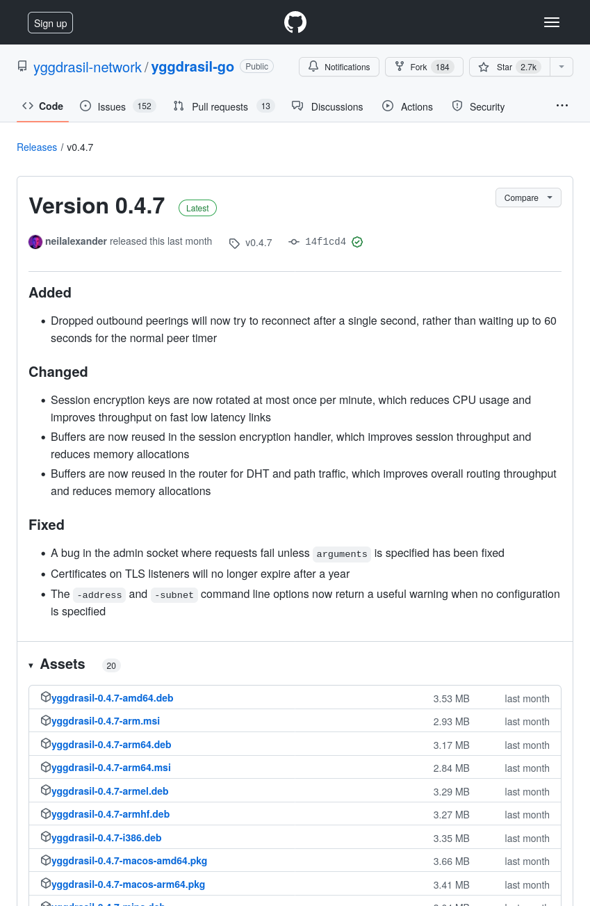

Find the file `yggdrasil-x.y.z-x64.msi` (for version 0.4.7 this is
`yggdrasil-0.4.7-x64.msi`). If you have a 32-bit system (from the 2000s),
download `yggdrasil-x.y.z-x86.msi` instead.


### Installing the MSI

Open the downloaded MSI file.

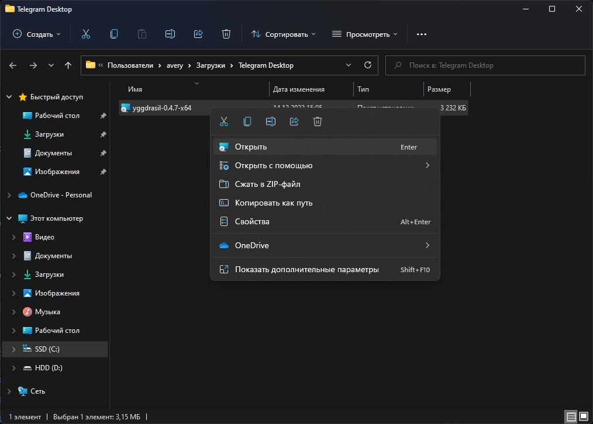

Confirm the launch by clicking **Run**.

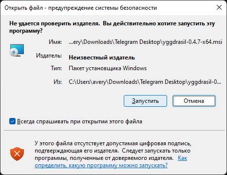

When prompted, grant the installer administrator rights.

The installer window will open and **no additional questions will be asked**.
After installation finishes (it takes only a few seconds) the window will **close automatically**.

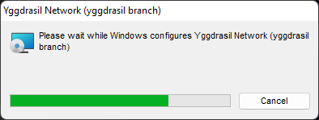

That's it for the installation process, now let's proceed to configuration.

#### Error 2503

Sometimes the 2503 error appears when installing MSI files. Open the properties
of the folder `C:\Windows\Temp`, go to the **Security** tab and make sure that
the **Administrators** group and your user (add it if it isn't listed) have
full permissions. Information taken from [Microsoft Community](https://answers.microsoft.com/en-us/windows/forum/all/error-code-2503-2502-when-installing-msi-file/0aa6840f-e625-4075-b1c5-051da100c151).

## Configuring peers

Peers are the servers Yggdrasil connects to in order to reach the rest of the
network.

It is better to choose one common, stable peer for all players – this minimizes
ping and prevents other people's traffic from passing through your connection
(public peers are responsible for forwarding traffic).

### Choosing peers

There is a repository with a [list of public peers](https://github.com/yggdrasil-network/public-peers)
on GitHub. Peers are grouped by continent, country and city. Choose peers that
are geographically closer to the host – this will reduce ping for all players.


For example, you can use my peer (Moscow): `tls://ygg-msk-1.averyan.ru:8363` or
`quic://ygg-msk-1.averyan.ru:8364` (the `quic` variant is preferable if it
works for you and isn't blocked).

However, not all of them may work – you can check the [list of available
peers](https://publicpeers.neilalexander.dev/) on the developer's website.

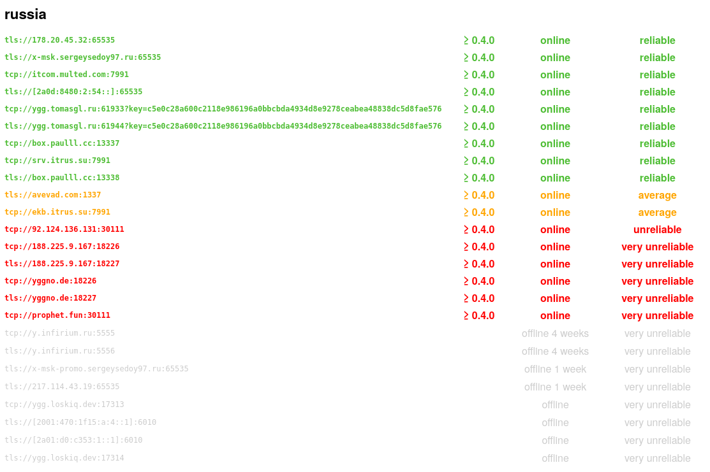

### Editing the config

Press `Win+R` to open the **Run** dialog. Enter the path to the config:
`%ALLUSERSPROFILE%\Yggdrasil\yggdrasil.conf`


Click **OK**. If Windows asks how to open the file, choose Notepad.

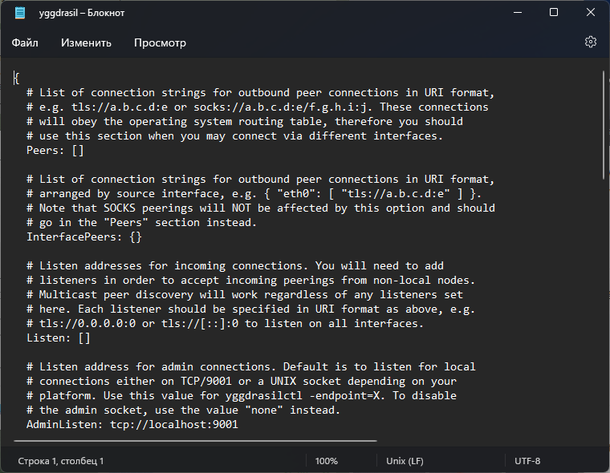

Insert the peers you chose into the **Peers** list:

```hjson
Peers: [
  tls://ygg.averyan.ru:8362
  tcp://box.paulll.cc:13337
]
```


Save the file with `Ctrl+S` or via the **File** menu.

### Restarting Yggdrasil

For Yggdrasil to apply the new settings, it needs to be restarted. The most
obvious (but slow) way is to reboot the computer. Instead, we'll restart it via
Task Manager.

Open **Task Manager** with `Ctrl+Shift+Esc` or by right-clicking the Windows
icon (Start button) on the taskbar.

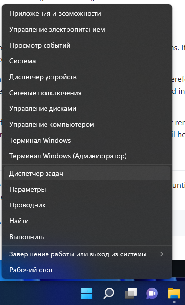

If the simplified Task Manager opens, click **More details**.


Open the **Services** tab, find **Yggdrasil** at the very bottom, right-click it
and choose **Restart**.

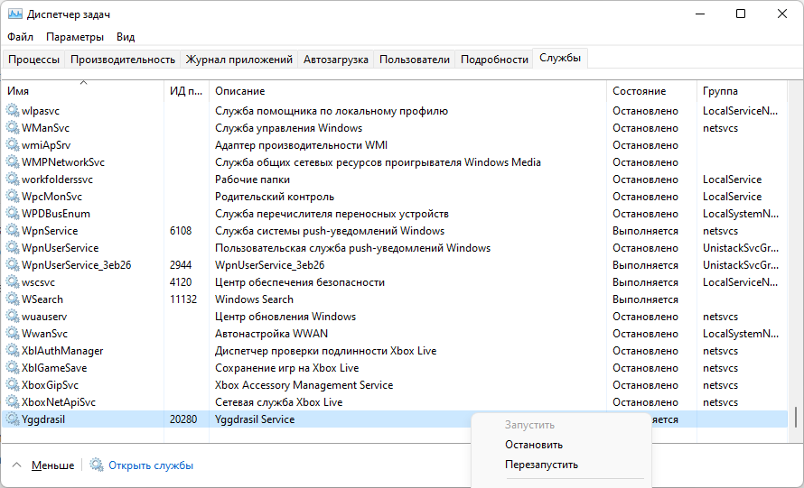

## Final steps

Installation and configuration are complete – let's check that everything works
and find out our IP address.

### Checking functionality

Open **Command Prompt**.

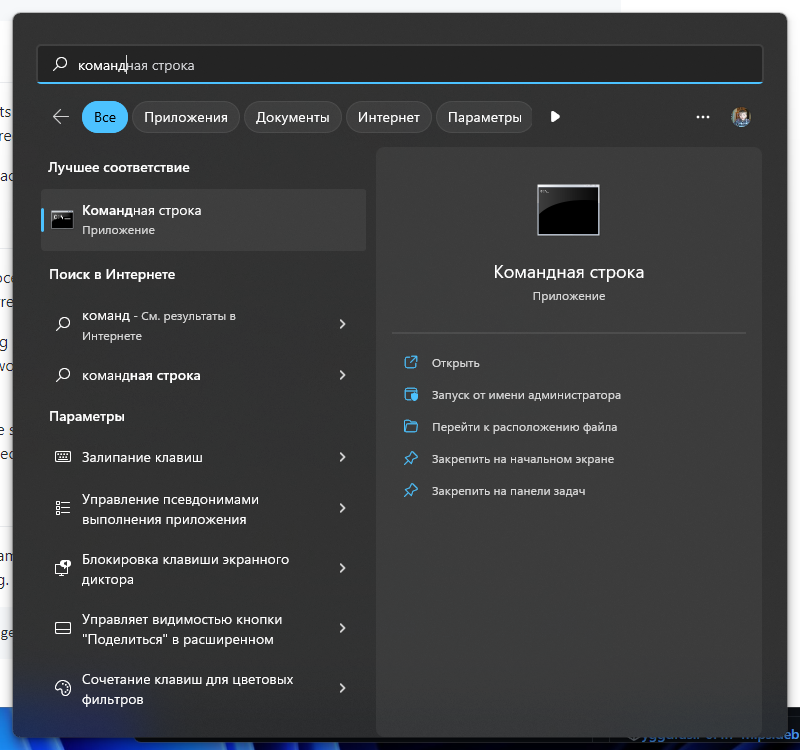

Enter the command `"C:\Program Files\Yggdrasil\yggdrasilctl.exe" getPeers` to
view the list of connected peers. There should be as many as you configured. If
there are fewer, some peers are unavailable.

If an error occurs when entering this command, try rebooting the computer.

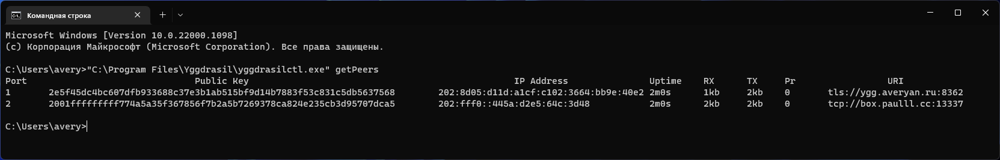

Try opening and pinging the [Yggdrasil website](http://[319:3cf0:dd1d:47b9:20c:29ff:fe2c:39be]/)
(**available only from the Yggdrasil network** and may load quite slowly):

```shell
ping [319:3cf0:dd1d:47b9:20c:29ff:fe2c:39be]
```


### Getting your IP address

To find out your own IP address, enter the command `"C:\Program
Files\Yggdrasil\yggdrasilctl.exe" getSelf`:

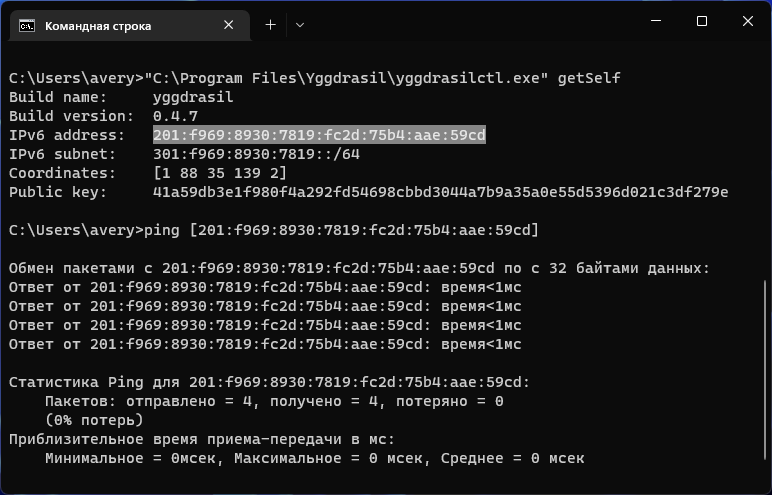

The highlighted line will show your IPv6 address in the Yggdrasil network.

You'll notice that the ping to your own address is practically zero.

## Configuring games

Yggdrasil is now installed on your computer and running. Let's use it for
network games.

### Minecraft

Install Yggdrasil on the device that will host the server and on those that
will connect to it.

Start a LAN game on the host (**Open to LAN**) and note the port:


Find out the host's IP address. (In my case it is
`200:d08:17f6:af6e:b285:16de:d3ba:387a`)

Connect to the server (enter the IP **in square brackets** and specify the port
after the colon):

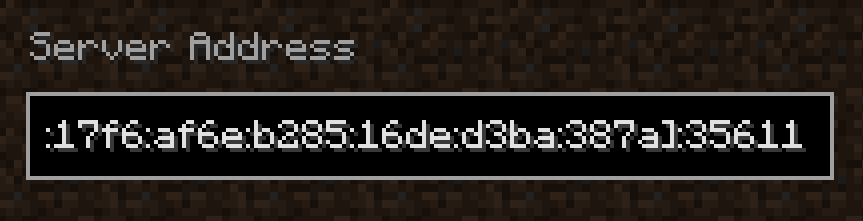

If you can't connect, try configuring the Windows Firewall or turning it off
completely, and also check the ping to the host.

Done! Now you can play Minecraft with your friends at any time.
