## Что такое Yggdrasil?

Yggdrasil - децентрализованная меш-сеть, все участники которой равноправны.
Каждому компьютеру в сети (ноде) назначается статический публичный IPv6 адрес, и все остальные
участники сети могут обращаться к нему напрямую.

Это можно использовать, например, для игры в сетевые игры в разных локальных сетях. Один игрок запускает
Minecraft сервер без платного "белого" IP, а второй подключается к нему из другого города по Yggdrasil.

## Установка

Приступим к установке - скачаем и установим Yggdrasil, настроим пиры для подключения,
проверим работоспособность и получим собственный IP-адрес.

### Скачивание установщика

Откройте страницу с [последним релизом](https://github.com/yggdrasil-network/yggdrasil-go/releases/latest) Yggdrasil на GitHub.

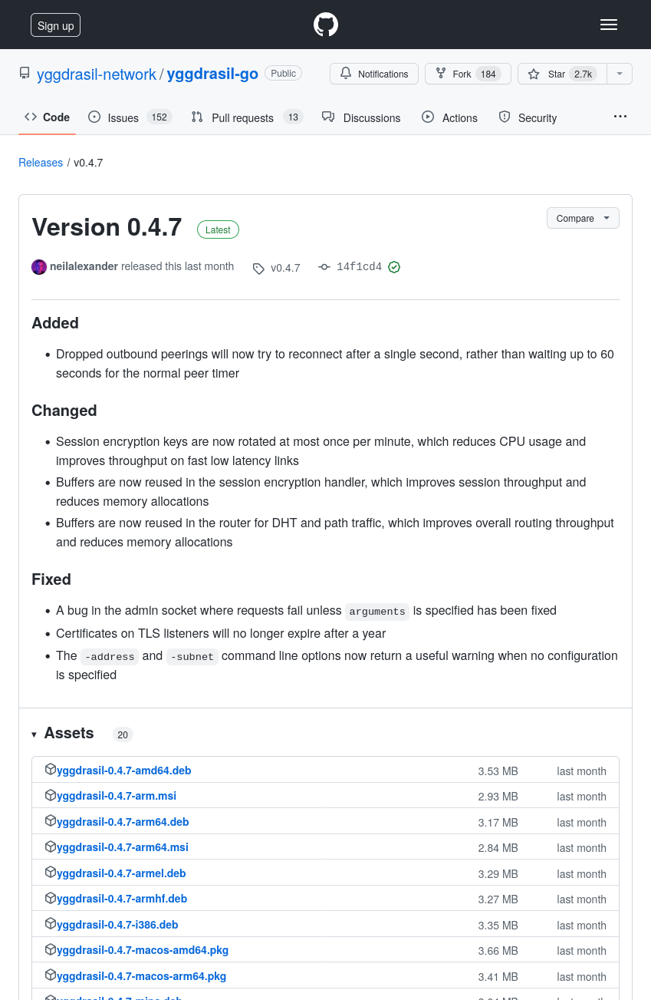

Найдите там файл `yggdrasil-x.y.z-x64.msi` (для версии 0.4.7 это `yggdrasil-0.4.7-x64.msi`).
Если же у вас 32-битная система (из 2000-х годов), скачайте файл `yggdrasil-x.y.z-x86.msi`.


### Установка MSI

Откройте установочный MSI файл.

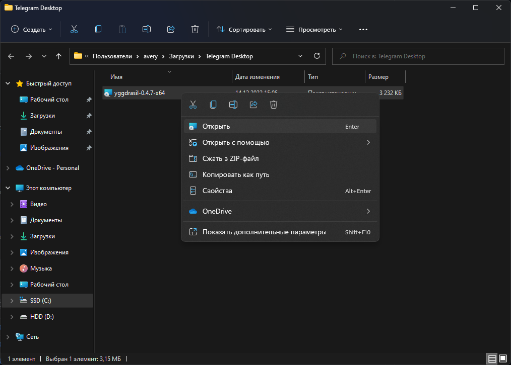

Подтвердите запуск (нажмите "**Запустить**").

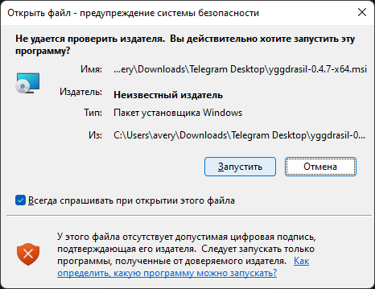

При запросе предоставьте установщику права администратора.

После этого откроется окно установщика и **дополнительных вопросов задаваться не будет**.
После завершения установки (она длится несколько секунд) это окно **сразу закроется**.

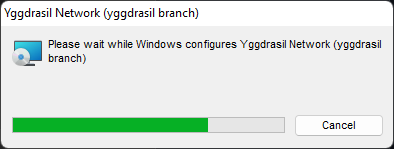

На этом процесс установки завершён, и мы переходим к настройке.

## Настройка пиров

Пиры - это те сервера, к которым подключается Yggdrasil, чтобы получить доступ к остальной сети.

Для надёжного соединение лучше настроить несколько пиров, но для меньшего пинга в сетевых играх - один и тот же пир у всех игроков.

### Выбор пиров

Существует репозиторий со [списком публичных пиров](https://github.com/yggdrasil-network/public-peers) на GitHub. Пиры в нём сгруппированы по континентам, странам и городам. Лучше выбирать те пиры, что ближе к хосту - так пинг у всех игроков будет меньше.

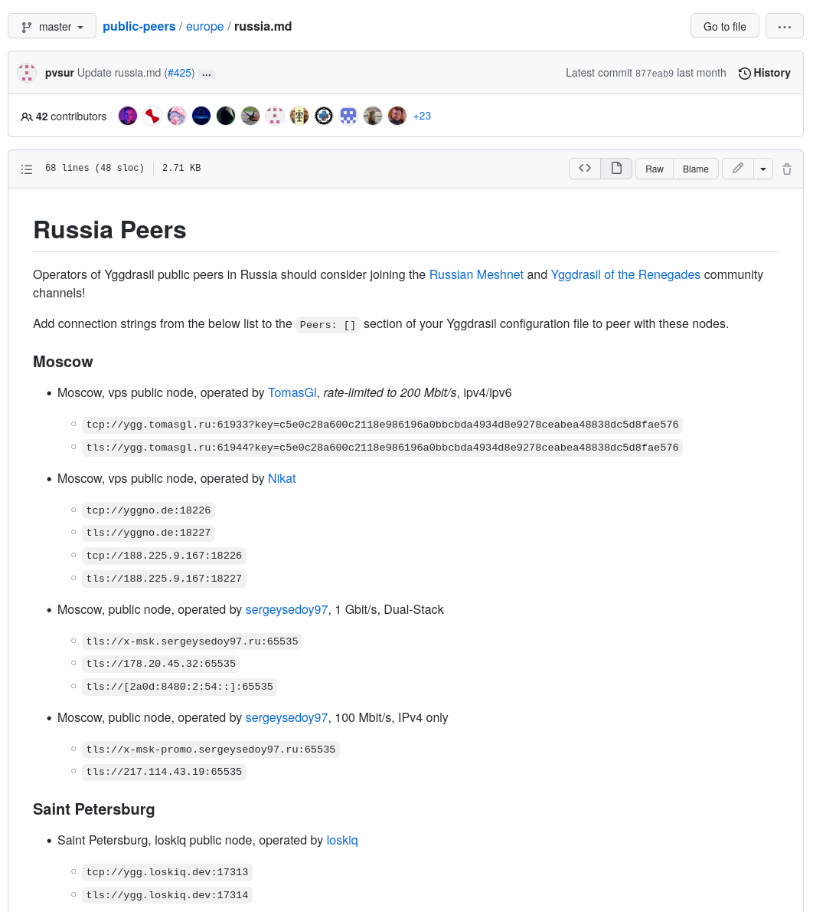

Например, можно использовать мой пир (г. Москва):
`tls://ygg.averyan.ru:8362`

Но, к сожалению, некоторые из них могут не работать. Проверить [список доступных пиров](https://publicpeers.neilalexander.dev/) можно
на сайте разработчика сети.

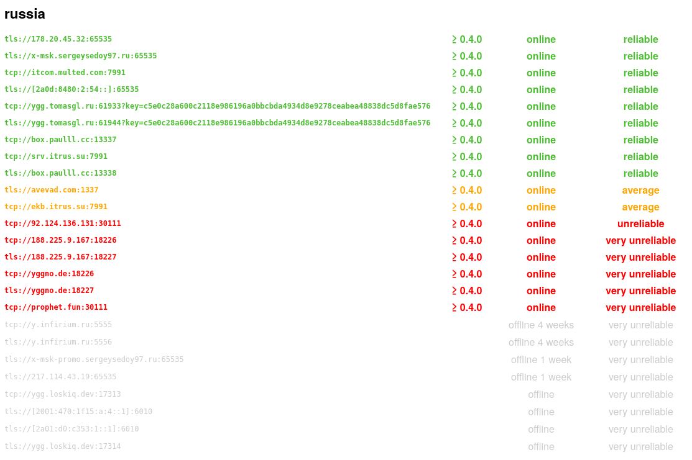

### Редактируем конфиг

Нажмите сочетание клавиш `Win+R`, чтобы запустить приложение "Выполнить".
Введите в нём путь до конфига:
`%ALLUSERSPROFILE%\Yggdrasil\yggdrasil.conf`


Нажмите OK. Если у вас спрашивают, как открыть файл - выберите Блокнот.

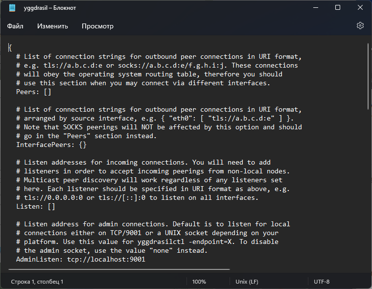

Введите выбранные вами пиры в список Peers. Перед адресами пиров должно быть по 4 пробела, а перед последней `]` - два.

```
==Peers: [
====tls://ygg.averyan.ru:8362
====tcp://box.paulll.cc:13337
==]
```

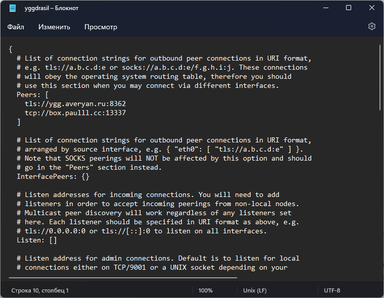

Сохраните конфиг сочетанием клавиш `Ctrl+S` или в меню "Файл".

### Перезапуск Yggdrasil

Чтобы Yggdrasil применил новые настройки, нужно его перезапустить. Самый очевидный (но долгий) способ - перезагрузить компьютер. Мы же перезапустим его в диспетчере задач.

Откройте Диспетчер Задач сочетанием клавиш `Ctrl+Shift+Esc` или кликом правой кнопкой мыши по значку Windows (кнопке Пуск) в панели задач.

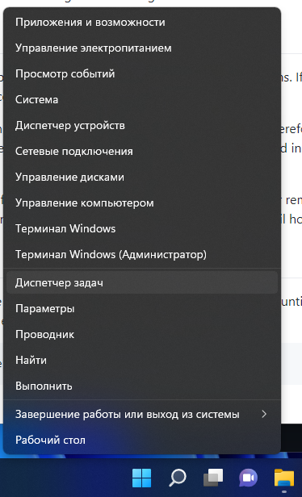

Если открылась упрощённая версия Диспетчера задач - нажмите кнопку "Подробнее".

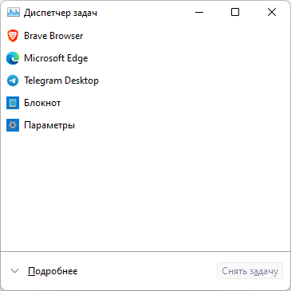

Откройте вкладу "Службы", найдите в самом низу Yggdrasil, нажмите по нему правкой кнопкой мыши и перезапустите.

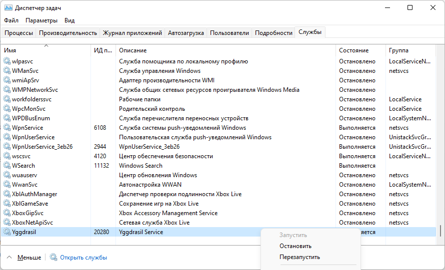

## Последние шаги

Установка и настройка завершена - осталось проверить, всё ли работает и узнать свой IP-адрес.

### Проверка работоспособности

Запустите Командную строку.

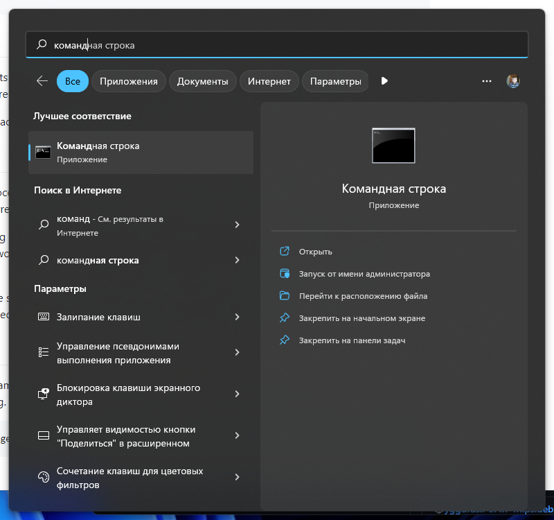

Введите команду `"C:\Program Files\Yggdrasil\yggdrasilctl.exe" getPeers`, чтобы посмотреть список подключенных пиров. Их должно быть столько, сколько вы указали. Если их меньше - какие то пиры недоступны.

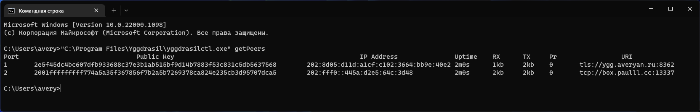

Попробуйте открыть и попинговать [сайт Yggdrasil](http://[319:3cf0:dd1d:47b9:20c:29ff:fe2c:39be]/)
(**доступен только из сети Yggdrasil** и может грузиться достаточно долго):

```
ping [319:3cf0:dd1d:47b9:20c:29ff:fe2c:39be]
```

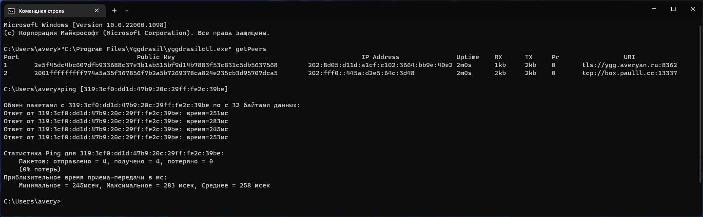

### Получение своего IP-адреса

Чтобы узнать свой IP-адрес, введите команду `"C:\Program Files\Yggdrasil\yggdrasilctl.exe" getSelf`:

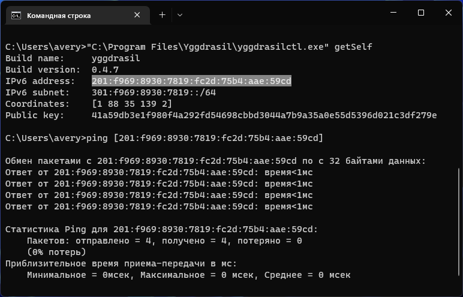

На месте выделенной строки будет ваш IPv6-адрес в сети Yggdrasil.

Можно заметить, что пинг до собственного адреса практическо нулевой.

## Настройка игр

Теперь Yggdrasil установлен на ваш компьютер и работает.
Давайте применим его для сетевой игры.

### Minecraft

Установите Yggdrasil на то устройство, которое будет хостить сервер и на те,
которые будут к нему подключаться.

Запустите сетевую игру на хосте (**Open to LAN**) и запомните порт:

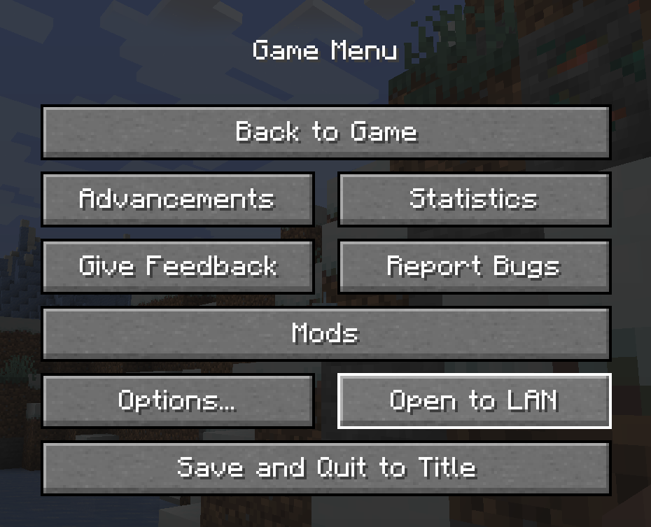


Узнайте IP-адрес хоста. (В моём случае это `200:d08:17f6:af6e:b285:16de:d3ba:387a`)

Подключитель к серверу (введите айпи **в квадратных скобках** и укажите порт через двоеточие):

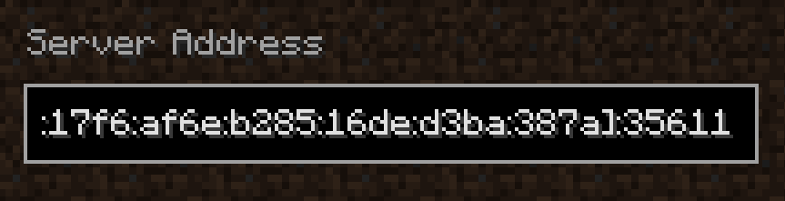

Готово! Теперь мы можете играть в Minecraft со своими друзьями в любое время.
